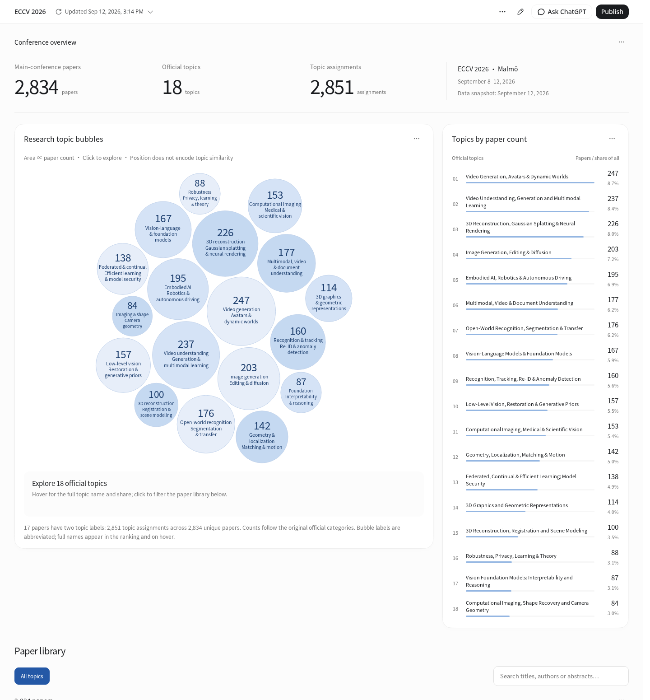

# Meta Research

Tools for analyzing and visualizing research trends and topic evolution across conferences and journals.

Meta Research is an NYU ICL project for studying research itself: how topics are distributed, how fields change over time, and how research areas connect across publication venues. The goal is to turn paper metadata into reproducible analyses and interactive views that support literature exploration and research planning.

## Current status

**Initial prototype · September 17, 2026.** The first release focuses on descriptive statistics and interactive exploration of **ECCV 2026**. A separate ECCV 2024 paper database is included as a foundation for future work. Cross-year trends, aligned topic taxonomies, cross-venue comparisons, and journal coverage are **not implemented yet**.

| Component | Available now |
| --- | --- |
| ECCV 2026 statistics | 2,834 main-conference papers, 18 official topic labels, and 2,851 paper–topic assignments |
| Interactive visualization | Topic bubbles and rankings; topic filtering; title, author, and abstract search; expandable abstracts; pagination and paper/PDF links |
| Portable viewer | Self-contained English HTML, usable locally without installation or an API key |
| Reproducible data preparation | Cached official source snapshots, normalized paper records, topic-count CSV, and a Python preparation script |
| Editable application | React dashboard source and the supplied compiled HTTP build |
| ECCV 2024 reference data | 2,387 papers in SQLite with full-text search, CSV/JSONL exports, and collection scripts |

The 2026 data snapshot was collected on **September 12, 2026**; the English package was prepared on September 17. Repository publication does not constitute a fresh data collection.



## Open the visualization

Download or clone this repository, then open [`eccv/2026/eccv_2026_en.html`](eccv/2026/eccv_2026_en.html) in Chrome or Edge. The file embeds its scripts, data, and fonts. Browsing is offline; following external paper and PDF links requires internet access. GitHub's file view does not run the visualization.

Alternatively, serve the supplied split build from the repository root:

```bash
python3 -m http.server 8000 --directory eccv/2026/dashboard/dist
```

Open <http://localhost:8000>. Keep the JSON sidecar alongside `index.html`. On Windows, use `py` instead of `python3` if needed.

## Interpreting the statistics

- The population is ECCV 2026 main-conference papers matched against the official accepted-paper list. Oral and Spotlight presentation events are not counted as additional papers.
- Topic labels come from the official source; the project does not generate topic classifications or abstract summaries.
- Each paper is counted once per assigned topic. Seventeen papers have two topics, so topic counts overlap and percentages need not sum to 100%.
- Topic share uses all 2,834 papers as the denominator. Bubble **area** represents count; bubble position does not represent semantic similarity.
- Topic selection and search filter the paper library, not the conference-level statistics.
- The 2024 and 2026 collections remain separate. A defensible trend comparison will require consistent coverage and topic definitions.

See [methods and visualization notes](eccv/2026/VISUALIZATION.md) for details.

## Repository layout

```text
eccv/
  2026/
    eccv_2026_en.html             # Portable interactive viewer
    dashboard/                   # React source, runtime, and supplied build
    reviewed.json                # Normalized papers, topics, and provenance
    eccv_2026_keyword_counts.csv  # Topic statistics
    eccv-2026-*.json              # Cached official metadata and abstracts
    eccv2026_accepted.html        # Cached accepted-paper list
    prepare_visualization.py     # Reproduce data exports from cached inputs
    check_dashboard_en.py        # Browser interaction checks
  2024/                          # Independent database, exports, and collectors
docs/                            # Import provenance and original file manifest
```

## Working with the source

Python 3's standard library is sufficient to reproduce the 2026 normalized records and topic-count export:

```bash
python3 eccv/2026/prepare_visualization.py
```

This updates `reviewed.json` and the topic CSV. It does **not** update `dashboard/src/data.json` or rebuild either viewer. Updating the application requires explicitly synchronizing the reviewed snapshot and rebuilding.

The supplied dashboard was built with the Data plugin runtime. Its source and build metadata are retained; a compatible Data plugin environment is required for the documented build/export workflow. This initial import has not established a standalone `npm` build workflow. See [development notes](eccv/2026/VISUALIZATION.md). No developer tooling is needed to use the supplied viewer.

To run the included interaction checks with Python Playwright and Chromium installed:

```bash
python3 eccv/2026/check_dashboard_en.py
```

The check serves the supplied HTTP build and updates the preview screenshots and `visual_checks_en.json`. See the [2024 database README](eccv/2024/README.md) for collection and SQL search examples.

## Planned directions

- Establish comparable datasets and topic mappings across ECCV editions.
- Analyze changes in topic prevalence and emerging research areas over time.
- Extend coverage to additional conferences and journals.
- Explore connections between papers and research areas with explicit, documented methods.

These are project directions, not release commitments or existing capabilities.

## Sources and provenance

ECCV 2026 inputs: [accepted papers](https://eccv.ecva.net/Conferences/2026/AcceptedPapers), [paper event metadata](https://eccv.ecva.net/static/virtual/data/eccv-2026-orals-posters.json), and [abstracts](https://eccv.ecva.net/static/virtual/data/eccv-2026-abstracts.json). ECCV 2024 inputs: [ECVA proceedings](https://www.ecva.net/papers.php) and linked paper pages.

Original abstracts and metadata retain their source attribution. The bundled font license is preserved in [`FONT-LICENSE.txt`](eccv/2026/dashboard/src/content/assets/FONT-LICENSE.txt). This import does not assign a new license to third-party material. See [import provenance](docs/IMPORT.md) for package details and verification scope.
